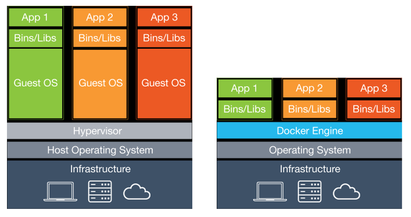

# Smart Gaz Pratical Class

## Context

This project is a pratical class to teach students how to use MQTT and CoAP protocols within an IoT project.

This is a git project with two main branches:
- exercice : where you can find all questions to answer during this pratical class
- solution : where you can find all answers to the previous questions (this branch will be available at the end)

This project is composed of two parts:
- MQTT
- COAP

First start with the MQTT part by reading the file mqtt/README.mq. Finally, finish with the COAP part by reading the file coap/README.mq

## Introduction to docker

This project uses Docker, an implementation of the technology of Linux containerization, to encapsulate linux processes. 

### VM vs Container

A Virtual Machine integrates an OS with application which makes it heavy.

A Docker Container only integrates application and libraries, it uses the basic Linux OS functionalities of the host machine.

### Definition

Here is the main concepts to learn about Docker:

- A Docker image is a snapshot of the process you want to run (code, OS, environment variables...)
- A Dockerfile is a file that defines a Docker image
- A Docker container is an instantiation of a Docker image

Here is the main commands:

Build an Docker image

    docker build -t <docker-image-name>:<docker-image-tag> -f /path/to/Dockerfile
    
Run a Docker container

    docker run -it <docker-image-name>:<docker-image-tag> 
    
### Docker compose

To run multiple Docker containers at the same time, use docker-compose. 
Indeed, from a yaml file name `docker-compose.yaml` you can specify all services and their corresponding Docker image to deploy.

Commands to use fom your project directory where there is `docker-compose.yaml`:

    docker-compose build # build all system
    docker-compose up # run all container of the system
    docker-compose down # in case you want to stop all containers of the system 
