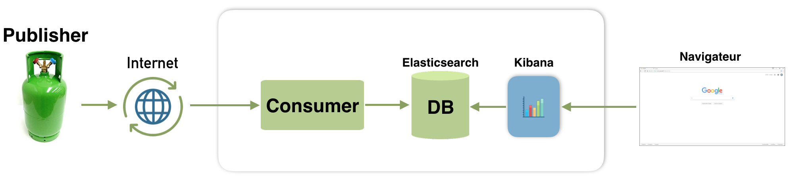
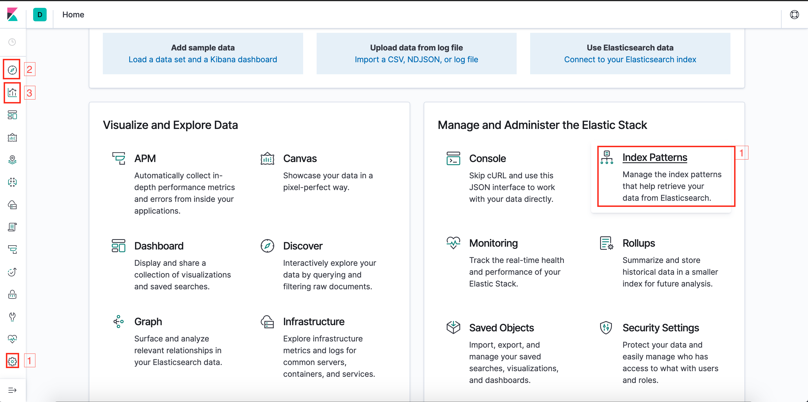

# Smart Gaz Pratical Class : CoAP protocol

## Context

Let's assume we want to develop a system that monitors a parc of gaz bottles. 
The purpose of this pratical class is to simulate a smart gaz meter that periodically measures ans sends the pressure, the temperature of an gaz bottle to an IoT platform.
In order to send data, the smart gaz meter needs to communicate withe the IoT platform by using an application protocol. Here we will use CoAP.
Finally, at every data reception the IoT platform does a transformation process before storing the modified data. 

Here is an image of the desired system:

- a smart gaz meter (publisher) measuring and sending data in CoAP
- a consumer retrieving and processing data before storing it
- a database (here we use [Elasticsearch](https://www.elastic.co/fr/products/elasticsearch))
- a tool to visualize data (here we use [Kibana](https://www.elastic.co/fr/products/kibana))

In this pratical class you will be asked to implement the previous system.

## Implementation

### Publisher

Let's develop the publisher. Go to folder publisher where you will find #TODO tasks to complete within four python files:
- src/main.py file where every ten second data is sent to a CoAP client
- src/utils/iot_data.py file where you have to implement functions to compute data to be sent
- test/utils/test_iot_data.py where you have to complete unit tests for functions in src/utils/iot_data.py 
- setup.py file that handles installation the python project. Run `python setup.py test` to validate you implementation.

### Consumer

Let's develop the consumer. Go to folder consumer where you will find #TODO tasks to complete within five python files:
- src/main.py file where data is retrieved from a CoAP server
- src/utils/es_client.py where an Elasticsearch client is implemented to insert data in Elasticsearch
- src/utils/iot_data.py file where you have to implement functions to process data to be stored
- test/utils/test_iot_data.py where you have to complete unit tests for functions in src/utils/iot_data.py 
- setup.py file that handles installation the python project. Run `python setup.py test` to validate you implementation.

### Install setup

#### Configuration

Let's install the system presented in the following picture:

You will use docker to install every component within containers

- Complete #TODO task within client/Dockerfile to run src/main.py file at the container execution
- Complete #TODO task within server/Dockerfile to run src/main.py file at the container execution
- Complete #TODO tasks within docker-compose.yaml (configuration file for all system)

#### Run

Run the following commands:

    docker-compose build # build all system
    docker-compose up # run all container of the system
    docker-compose down # in case you want to stop all containers of the system 

In case where a port is already used in your computer, run the following command to stop the service:

    kill -9 $(lsof -t -i:<port>)

If you need to access to containers use the following commands:

    docker exec -it coapclient bash
    docker exec -it coapserver bash

If you need to access to logs of a container use the following command:
    
    docker-compose logs coapclient

### Visualize data

Let's visualize data stored in database. Open a navigator and goes to `http://localhost:5601`.

You shoud see the following screen:

As indicated with numbers in the previous image, do the following steps:

- 1: Configure index pattern (you should see your index name that your indicated in the docker-compose.yaml)
- 2: Explore your data
- 3: Create a [visualization](https://www.elastic.co/guide/en/kibana/current/visualize.html) like a line chart to show the evolution of number of moles and pressure over time
